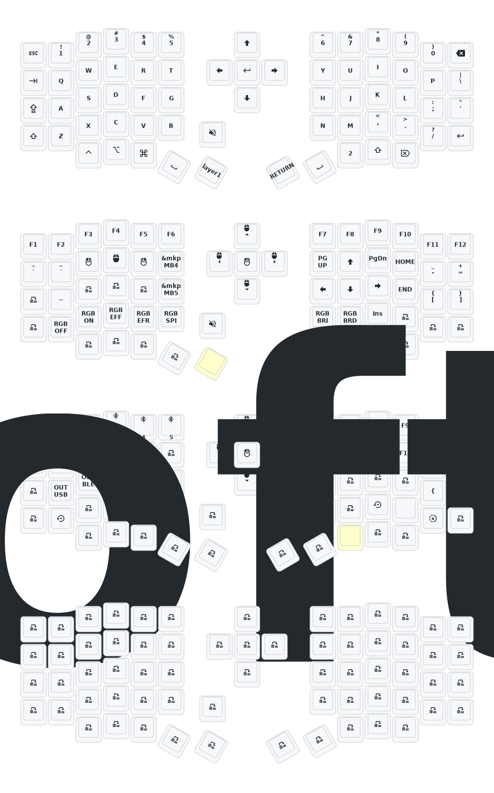

- [中文](README.md)
- [English](README_EN.md)

# 更新列表
- 2025/3/30 增加睡眠进入时间1小时  增加防抖时间 优化睡眠后功耗 
- 2024/12/21
  1. 增加zmk-studio支持（只需要刷新左手即可使用）。
- 2024/10/24
  1. 修改供电模式，功耗降低。
  2. 修正RGB供电自动关闭的功能。

> 如果您的键盘于10月24日之前更新，请更新最新的固件。
> 
---
# 联系我

如需3D打印的模型文件或者键盘有任何异常和故障，请联系380465425@qq.com

# Sofle键位图

This will allow you to reference the actions defined in the header such as `RGB_TOG`.

| Define          | Action                                                        |
|-----------------|---------------------------------------------------------------|
| `RGB_ON`        | Turns the RGB feature on                                      |
| `RGB_OFF`       | Turns the RGB feature off                                     |
| `RGB_TOG`       | Toggles the RGB feature on and off                            |
| `RGB_HUI`       | Increases the hue of the RGB feature                          |
| `RGB_HUD`       | Decreases the hue of the RGB feature                          |
| `RGB_SAI`       | Increases the saturation of the RGB feature                   |
| `RGB_SAD`       | Decreases the saturation of the RGB feature                   |
| `RGB_BRI`       | Increases the brightness of the RGB feature                   |
| `RGB_BRD`       | Decreases the brightness of the RGB feature                   |
| `RGB_SPI`       | Increases the speed of the RGB feature effect’s animation     |
| `RGB_SPD`       | Decreases the speed of the RGB feature effect’s animation     |
| `RGB_EFF`       | Cycles the RGB feature’s effect forwards                      |
| `RGB_EFR`       | Cycles the RGB feature’s effect in reverse                    |
| `RGB_COLOR_HSB` | Sets a specific HSB (HSV) value for the underglow             |

