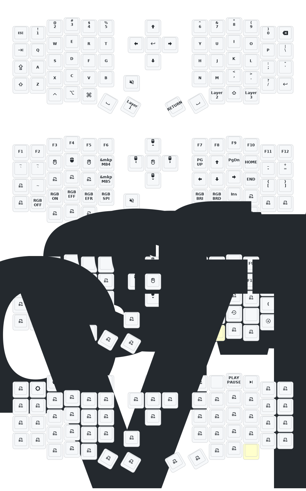

- [Chinese](README.md)
- [English](README_EN.md)

# Update List

- 2024/12/21
  1. Added support for zmk-studio (just refresh the left hand to use).
- 2024/10/24
  1. Modified power supply mode to reduce power consumption.
  2. Fixed the automatic shut-off feature for RGB power supply.

> If your keyboard was updated before October 24, please update to the latest firmware.
> 
---
# Contact Me

For 3D printed model files or any issues and malfunctions with the keyboard, please contact 380465425@qq.com

# Sofle Keymap

This will allow you to reference the actions defined in the header such as `RGB_TOG`.

| Define          | Action                                                        |
|-----------------|---------------------------------------------------------------|
| `RGB_ON`        | Turns the RGB feature on                                      |
| `RGB_OFF`       | Turns the RGB feature off                                     |
| `RGB_TOG`       | Toggles the RGB feature on and off                            |
| `RGB_HUI`       | Increases the hue of the RGB feature                          |
| `RGB_HUD`       | Decreases the hue of the RGB feature                          |
| `RGB_SAI`       | Increases the saturation of the RGB feature                   |
| `RGB_SAD`       | Decreases the saturation of the RGB feature                   |
| `RGB_BRI`       | Increases the brightness of the RGB feature                   |
| `RGB_BRD`       | Decreases the brightness of the RGB feature                   |
| `RGB_SPI`       | Increases the speed of the RGB feature effect’s animation     |
| `RGB_SPD`       | Decreases the speed of the RGB feature effect’s animation     |
| `RGB_EFF`       | Cycles the RGB feature’s effect forwards                      |
| `RGB_EFR`       | Cycles the RGB feature’s effect in reverse                    |
| `RGB_COLOR_HSB` | Sets a specific HSB (HSV) value for the underglow             |

